# MicroSpringBoot - Java Web Application Server

Minimal HTTP server built with **plain Java** (no Spring Boot, no Servlets, no Jetty).  
It implements an IoC framework that detects web components using reflection and runtime annotations.

## Architecture

```
HTTP Request (TCP)
       |
       v
 HttpServer (ServerSocket on port 8080)
       |
       |- Is it a static file (.html, .png)?
       |        \--> getResourceAsStream("/webroot/...")  -> response with correct Content-Type
       |
       \- Is it a registered route?
                \--> MicroSpringBoot.invoke(method, instance, queryParams)
                              |
                              \--> Reflection: resolve @RequestParam -> invoke method -> return String
```

**Framework classes:**

- `@RestController` - Marks a class as a web component detectable by the scanner.
- `@GetMapping` - Maps a method to an HTTP GET route.
- `@RequestParam` - Extracts parameters from the URL query string.
- `MicroSpringBoot` - Reflection engine: loads controllers, registers routes, invokes methods.
- `HttpServer` - HTTP server over `ServerSocket`. Handles requests in a non-concurrent way.
- `ClassPathScanner` - Scans the classpath looking for `@RestController` automatically.
- `MicroSpringBootApp` - Final entry point: scan + integrated HTTP server.

**Example controllers:**

- `HelloController` - Three simple routes without parameters (`/`, `/hello`, `/pi`).
- `GreetingController` - Route with `@RequestParam` (`/greeting?name=X`).

## Requirements

- Java 17 or higher
- Maven 3.6 or higher

## Installation
```bash
git clone https://github.com/Juan-cely-l/Taller-de-Arquitecturas-de-Servidores-de-Aplicaciones-.git
cd Taller-de-Arquitecturas-de-Servidores-de-Aplicaciones
mvn compile
```

## Running

### Version 1 - Load one controller from the command line

```bash
java -cp target/classes edu.escuelaing.arep.MicroSpringBoot \
     edu.escuelaing.arep.HelloController /pi
```

Expected output:
```
  Registered: GET / -> index()
  Registered: GET /pi -> webMethodPi()
  Registered: GET /hello -> webMethodHello()
Result: Pi= 3.141592653589793
```

### Final Version - Full HTTP server with automatic scanning

```bash
java -cp target/classes edu.escuelaing.arep.MicroSpringBootApp
# Or with Maven:
mvn exec:java -Dexec.mainClass="edu.escuelaing.arep.MicroSpringBootApp"
```

Expected output:
```
=== Starting MicroSpringBoot Framework ===
  [SCAN] Loading: edu.escuelaing.arep.GreetingController
    Registered: GET /greeting -> greeting()
  [SCAN] Loading: edu.escuelaing.arep.HelloController
    Registered: GET / -> index()
    Registered: GET /pi -> webMethodPi()
    Registered: GET /hello -> webMethodHello()
Available routes: [/, /pi, /hello, /greeting]
Listening on http://localhost:8080
```

## Available Endpoints

| Route | Description |
|---|---|
| `GET /` | Main greeting |
| `GET /hello` | Hello World |
| `GET /pi` | Pi value |
| `GET /greeting` | Greeting with default value ("World") |
| `GET /greeting?name=Carlos` | Custom greeting |
| `GET /index.html` | Static HTML page |
| `GET /logo.png` | Static PNG image |

```bash
curl http://localhost:8080/hello
curl "http://localhost:8080/greeting?name=Maria"
curl -I http://localhost:8080/logo.png
```

## Automated Tests

```bash
mvn test
```


```

Tests verify:
- RUNTIME retention for all three annotations.
- Correct route registration when loading a controller.
- Rejection of classes without `@RestController`.
- Invocation of methods without parameters.
- Resolution of `@RequestParam` with provided value.
- Use of `defaultValue` when the parameter is missing in the URL.
- Query string parsing with multiple parameters.
- Correct HTTP response format (status, Content-Length, body).
- Server returns 200 for `GET /hello` (mocked socket).
- Server returns 404 for unknown routes.

## Controller Example

```java
@RestController
public class GreetingController {

    private static final String TEMPLATE = "Hello %s";
    private final AtomicLong counter = new AtomicLong();

    @GetMapping("/greeting")
    public String greeting(@RequestParam(value = "name", defaultValue = "World") String name) {
        return String.format(TEMPLATE, name) + " (visit #" + counter.incrementAndGet() + ")";
    }
}
```


## Visual Evidence (Assets)

### 1. Phase 1 execution from CLI
This screenshot shows the execution of the first phase using `mvn exec:java` with `HelloController` and the `/pi` route. It confirms route registration and successful method invocation in console mode.


### 2. GET `/`
This screenshot validates the root endpoint response. The server returns the main greeting text from `HelloController#index`.


### 3. GET `/greeting`
This screenshot shows the default behavior of `GreetingController#greeting` when no `name` query parameter is provided. It uses the fallback value and increments the visit counter.


### 4. GET `/greeting?name=Esteban`
This screenshot demonstrates query parameter resolution with `@RequestParam`. The response includes the provided name (`Esteban`) and the updated visit count.

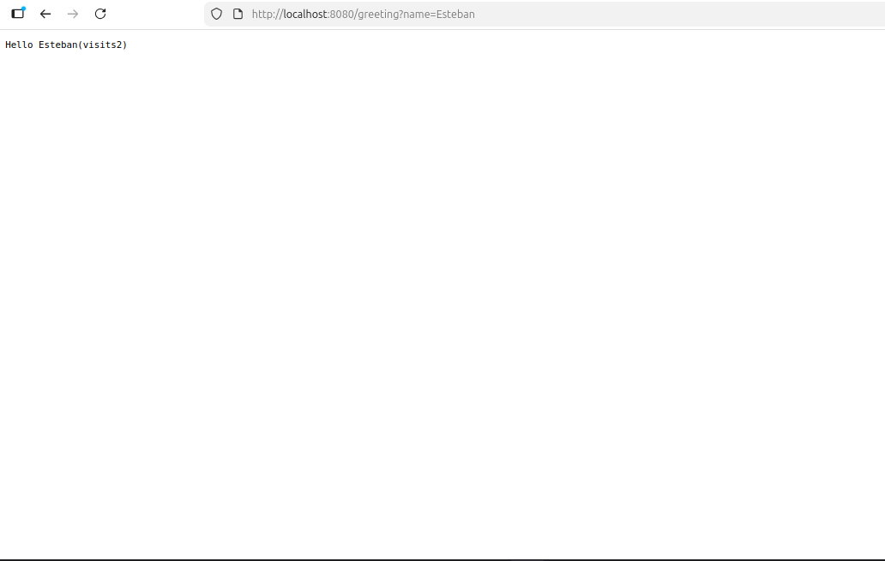

### 5. GET `/hello`
This screenshot validates the fixed string response for the `/hello` endpoint from `HelloController#webMethodHello`.


### 6. GET `/pi`
This screenshot shows the `/pi` endpoint returning the value of `Math.PI`, confirming that numeric values are correctly serialized as plain text HTTP responses.

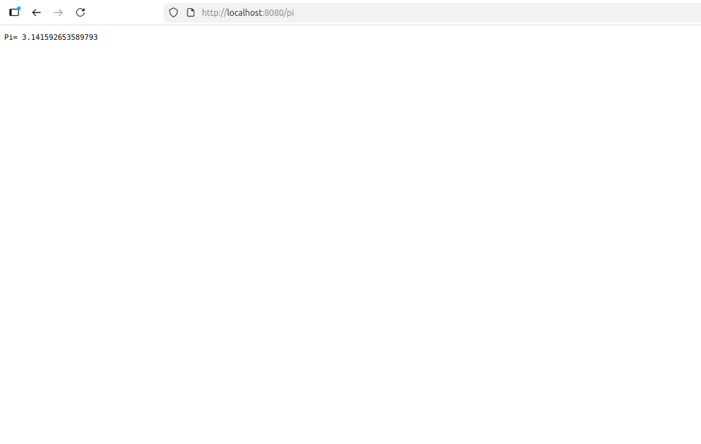

### 7. GET `/index.html`
This screenshot shows the static HTML page served from `/webroot/index.html`. It confirms static file resolution from the classpath and proper rendering of the index page with links to the available endpoints.

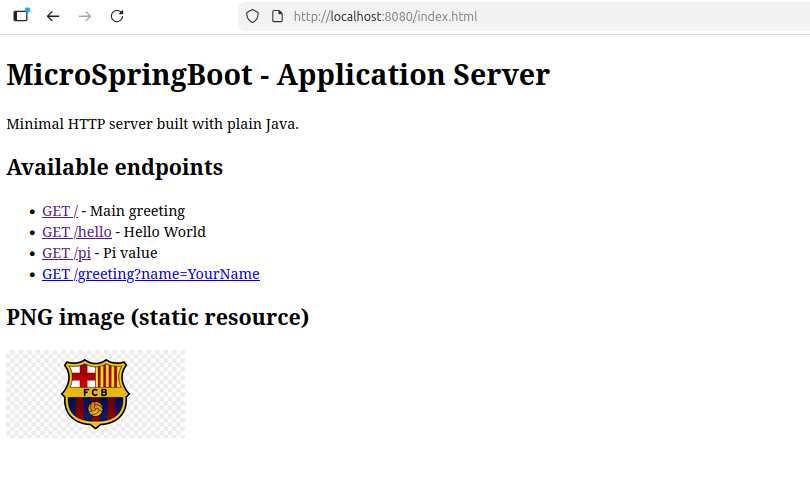

### 8. GET `/logo.png`
This screenshot validates direct static image delivery for `/logo.png`. It confirms that the server returns the PNG resource with the expected content and browser rendering behavior.


## AWS EC2 Deployment

This project was deployed to an **Amazon EC2 instance** and exposed through the instance public IP on port `8080`.

### EC2 deployment steps

1. Connect to the EC2 instance using SSH (`ec2-user`).
2. Copy the generated JAR to the instance (`taller.jar`).
3. Run the app with:

```bash
java -cp taller.jar edu.escuelaing.arep.MicroSpringBootApp
```

4. Ensure the EC2 Security Group allows inbound TCP traffic on ports `22` (SSH) and `8080` (application HTTP).
5. Validate the public routes from a browser:

```text
http://54.226.203.123:8080/
http://54.226.203.123:8080/hello
http://54.226.203.123:8080/pi
http://54.226.203.123:8080/greeting?name=Esteban
http://54.226.203.123:8080/index.html
http://54.226.203.123:8080/logo.png
```

### EC2 evidence screenshots

#### 1. Application launch from EC2 terminal
This image shows the instance terminal listing `taller.jar` and starting the server with `java -cp taller.jar ...`. It confirms that controllers were discovered and routes were registered correctly before the server began listening on port `8080`.

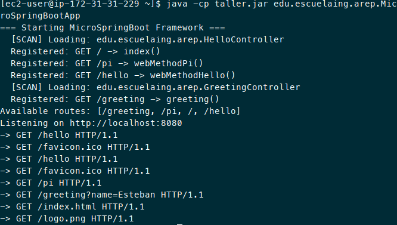

#### 2. Server running and receiving requests
This terminal output confirms the application is active on the EC2 instance and logs incoming HTTP requests (`/hello`, `/pi`, `/greeting`, `/index.html`, `/logo.png`). It proves end-to-end traffic reached the remote server.

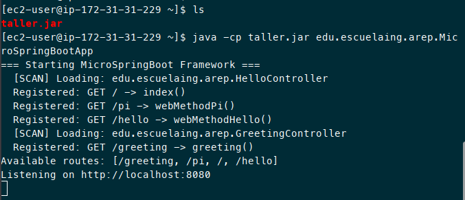

#### 3. GET `/hello` from public EC2 IP
This browser capture verifies that `http://54.226.203.123:8080/hello` returns the expected plain-text response (`Hello, World!`) from `HelloController`.

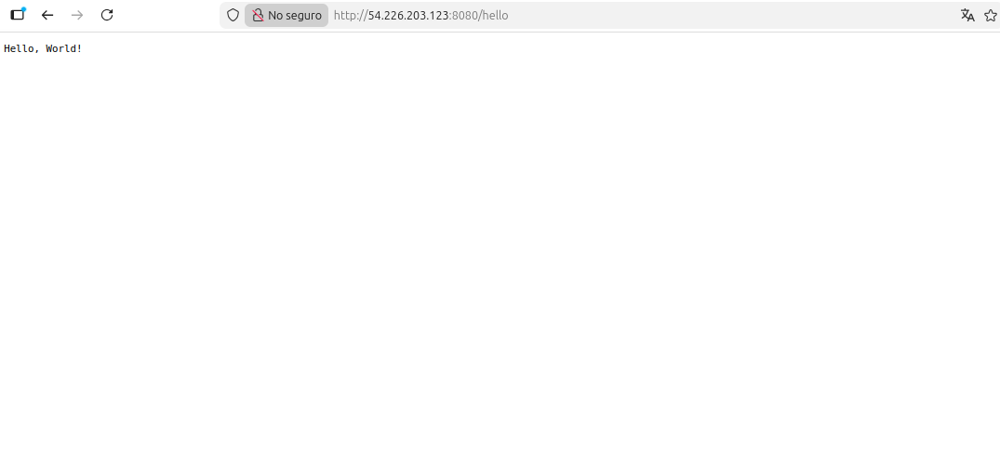

#### 4. GET `/index.html` from public EC2 IP
This screenshot confirms static HTML delivery from the deployed server. It also shows the endpoint list rendered in the browser, validating classpath static resource handling in EC2.

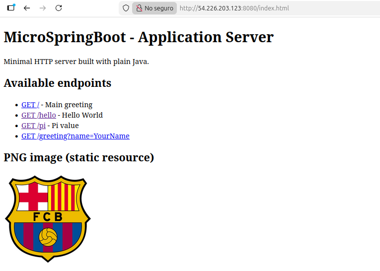

#### 5. GET `/logo.png` from public EC2 IP
This image demonstrates correct static PNG delivery directly from `http://54.226.203.123:8080/logo.png`, proving binary file responses are working in the cloud deployment.

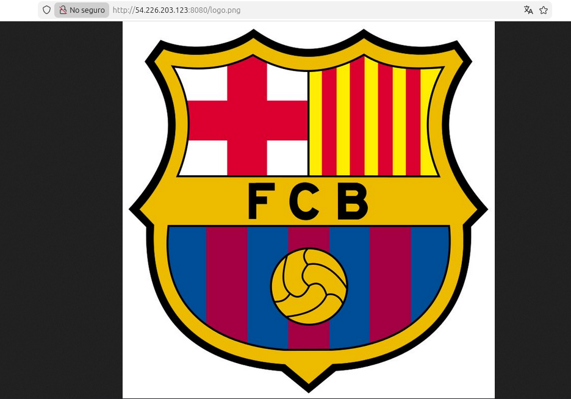

#### 6. GET `/greeting?name=Esteban` from public EC2 IP
This screenshot validates query parameter processing in production. The server receives `name=Esteban` and returns a personalized response with the visit counter.

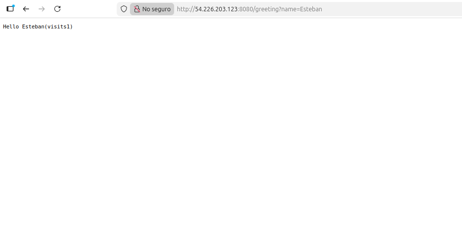

#### 7. GET `/pi` from public EC2 IP
This capture confirms that the `/pi` route is available through EC2 and returns the numeric value of `Math.PI` as expected.

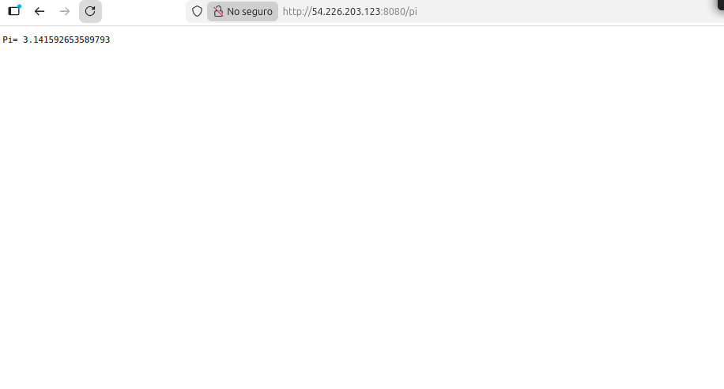

## Design Decisions

**Non-concurrent by design**: The assignment asks for this explicitly. The `while(true)` in `HttpServer.start()` handles one request at a time. For production, an `ExecutorService` or `VirtualThreads` would be used, but for this educational prototype the sequential loop is correct and easier to debug.

**`getResourceAsStream()` for static files**: Works both in development (`target/classes/`) and packaged in a JAR, without hardcoding OS filesystem paths.

**Separation of responsibilities**: `MicroSpringBoot` only handles reflection. `HttpServer` only handles TCP/HTTP. `ClassPathScanner` only handles classpath discovery. This makes each class independently testable.

## Docker Workflow and EC2 Container Deployment

This section documents the containerization process, image publication, local validation, and final deployment on AWS EC2.

### 1. Dockerfile definition
This screenshot shows the Dockerfile used to package the Java application. It defines the working directory, copies compiled classes and dependencies, and sets the startup command.

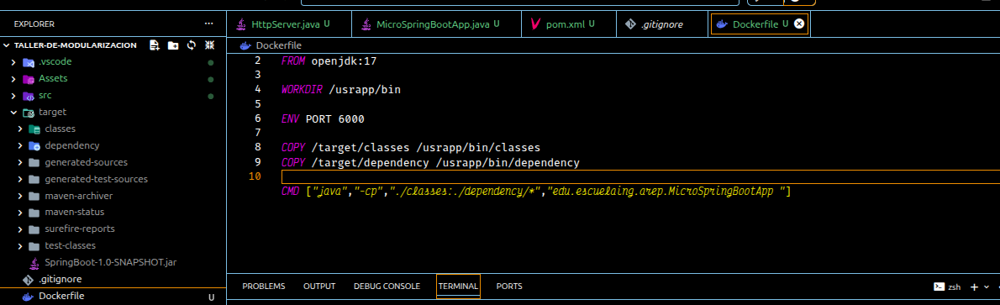

### 2. Runtime dependencies prepared in `target/dependency`
This image confirms that all required JAR dependencies were extracted into `target/dependency`, which are later copied into the container image.

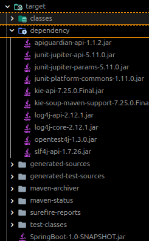

### 3. Local execution command before containerization
This capture shows the application running locally with the full classpath (`target/classes` + `target/dependency/*`) to validate behavior before building the Docker image.

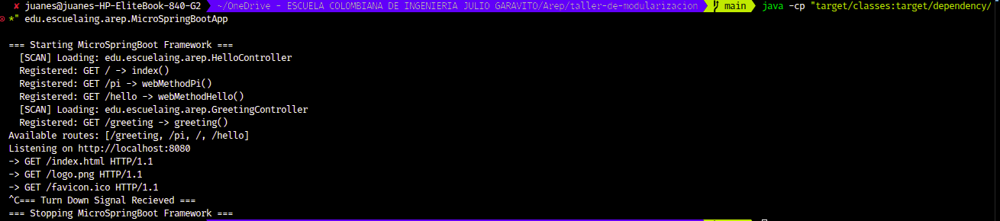

### 4. Docker image build process
This terminal output shows `docker build --tag dockersparkprimer .` successfully creating the application image from the Dockerfile.

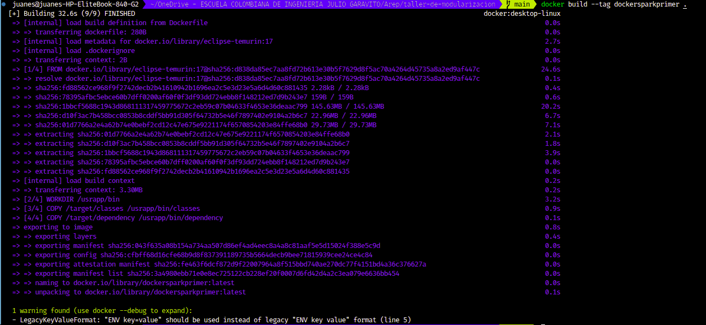

### 5. Local Docker image verification
This screenshot validates that the image exists locally after build, with the expected tag and size.

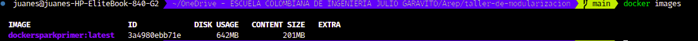

### 6. Push image to Docker Hub
This evidence shows the `docker push` process uploading all image layers to Docker Hub.

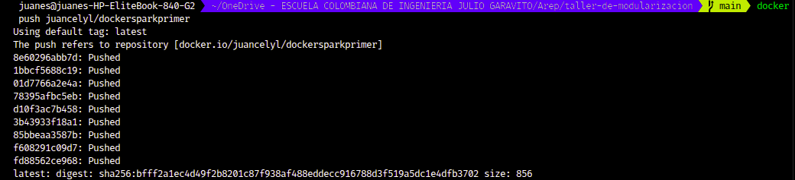

### 7. Pull command reference in Docker Hub
This screenshot shows the repository pull reference command that can be used from remote hosts (including EC2).


### 8. Published tag in Docker Hub
This image confirms that the `latest` tag is available in Docker Hub and ready for deployment.

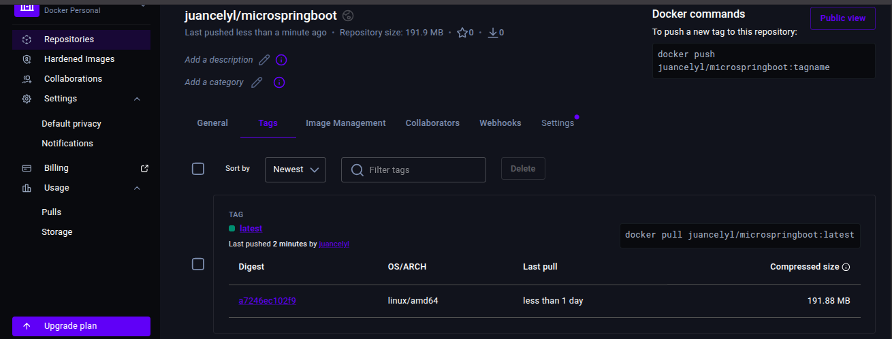

### 9. Running multiple local containers from the same image
This terminal output shows multiple `docker run` commands launching independent containers from the same application image on different ports.

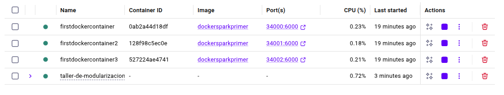

### 10. Multiple container instances confirmed
This screenshot verifies the three running instances in `docker ps`, each mapped to a different host port.

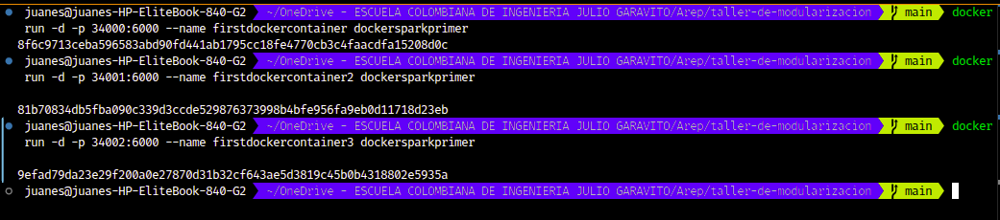

### 11. `docker-compose.yml` service definition
This screenshot shows the compose file defining the `web` service and a `mongodb` service, including ports, volumes, and container names.

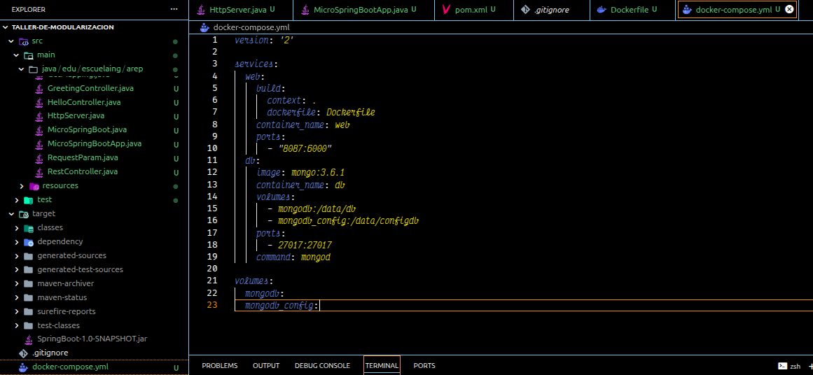

### 12. Docker Compose startup output
This capture confirms `docker compose up -d` pulled dependencies, built the image, created network/volumes, and started containers.

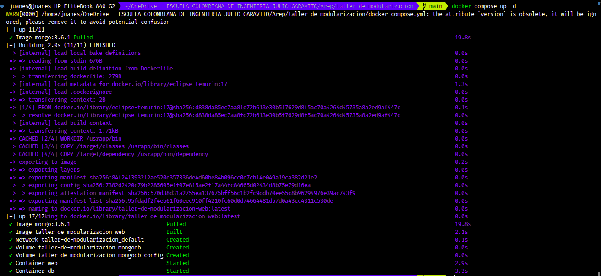

### 13. Running services from Compose
This terminal output validates active containers for both application (`web`) and database (`db`) services with their exposed ports.

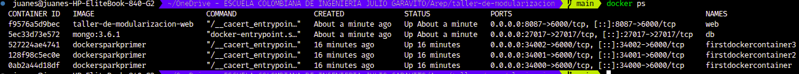

### 14. Containers visible in Docker Desktop
This screenshot provides an additional visual confirmation from Docker Desktop showing active containers and published ports.

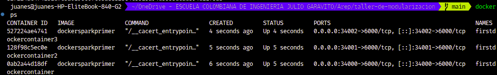

### 15. Functional endpoint check through Docker port mapping
This browser capture validates the `/greeting` endpoint through a mapped Docker port, confirming the service is reachable and processing query parameters.

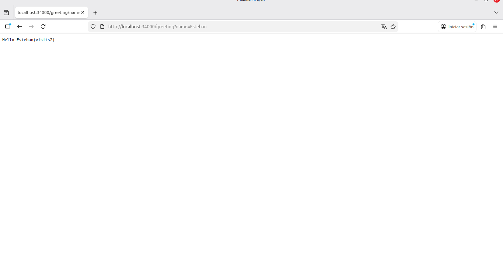

### 16. EC2 deployment from published Docker image
This terminal screenshot shows SSH access to EC2, `docker pull` from Docker Hub, container startup with `-p 34000:6000`, and `docker ps` verification.

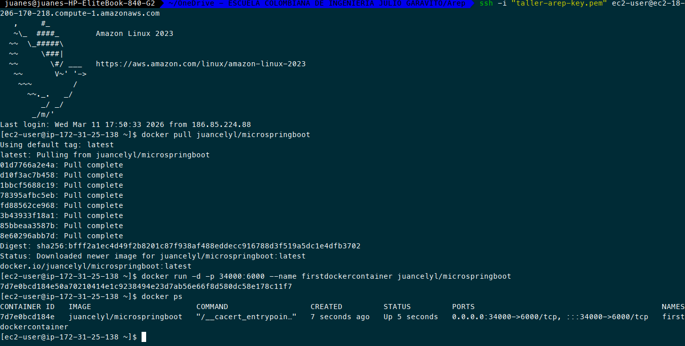

### 17. Public EC2 endpoint validation
This browser evidence confirms the containerized app is reachable from the EC2 public DNS on port `34000` and serves `index.html` correctly.

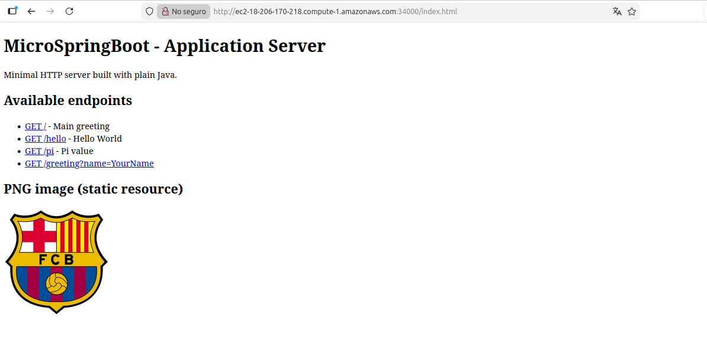

## Deployment Video (Final Evidence)

The complete Docker workflow and EC2 deployment recording is provided here:

<video controls width="960">
  <source src="Assets/2026-03-11%2013-05-42.mp4" type="video/mp4">
  Your browser does not support embedded video.
</video>

[Open/download deployment video](Assets/2026-03-11%2013-05-42.mp4)
